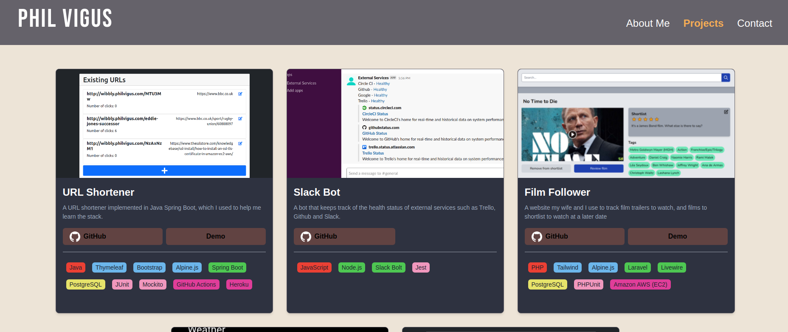

# URL Shortener



This is my professional portfolio.

**[See it live here!](https://www.philvigus.com/)**

## Technologies used

| Purpose                    | Technology                  |
| :------------------------- | :-------------------------- |
| Language                   | JavaScript                  |
| Front end                  | React, Chakra UI            |
| Linting/Static code checks | ESLint, Prettier            |
| Testing                    | Jest, React Testing Library |
| CI/CD                      | Netlify                     |

## Getting started

```bash
# clone the repositories to your local machine with either
git clone git@github.com:PhilipVigus/portfolio2.git
```

The following assumes you have node and npm set up on your machine

```bash
npm start
```

## Testing

```bash
npm test
```
